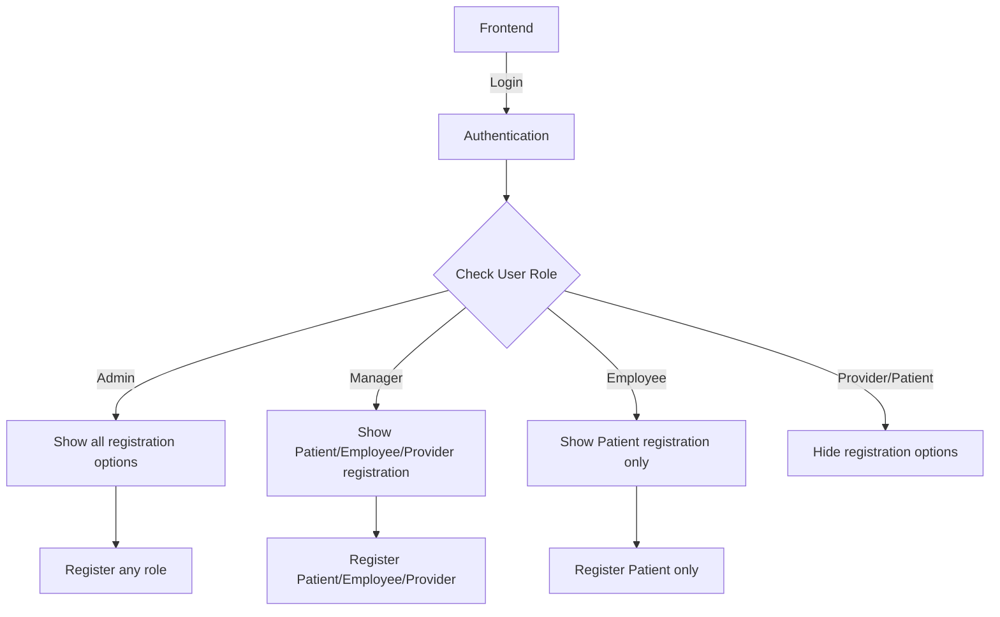

# EHR Backend API Documentation for Frontend Developers

## Overview

This document provides comprehensive API documentation for the Electronic Health Record (EHR) backend system. The API follows RESTful principles and uses JWT-based authentication with role-based access control (RBAC).

### Base URL

```javascript
http://localhost:3001/api
```

### Authentication

All endpoints (except `/api/auth/login` and `/api/health/*`) require authentication via JWT token sent in cookies.

### Response Format

```json
{
  "success": true|false,
  "message": "Descriptive message",
  "data": {}|[],
  "error": "Error details (if any)"
}
```

## Table of Contents

1. [Authentication](#authentication)
2. [User Management](#user-management)
3. [Patient Records](#patient-records)
4. [Role-Based Endpoints](#role-based-endpoints)
5. [System Operations](#system-operations)
6. [Error Handling](#error-handling)
7. [Examples](#examples)
8. [Security Notes](#security-notes)
9. [Testing](#testing)
10. [Support](#support)

## 1. Authentication

### Login

**POST** `/api/auth/login`

Authenticate user and receive JWT token.

**Request Body:**

```json
{
  "email": "user@example.com",
  "password": "password123"
}
```

**Response:**

```json
{
  "success": true,
  "message": "Login successful",
  "data": {
    "user": {
      "id": "user_id",
      "name": "John Doe",
      "email": "user@example.com",
      "role": "Patient"
    }
  }
}
```

### Get Current User

**GET** `/api/auth/me`

Get authenticated user's information.

**Headers:**
- Cookie: `token=jwt_token_here`

**Response:**

```json
{
  "success": true,
  "message": "User retrieved successfully",
  "data": {
    "user": {
      "id": "user_id",
      "name": "John Doe",
      "email": "user@example.com",
      "role": "Patient",
      "phone": "123-456-7890",
      "address": "123 Main St"
    }
  }
}
```

### Logout

**POST** `/api/auth/logout`

Invalidate current session.

## 2. User Management

### Register User

**POST** `/api/users/register`

Register a new user (RBAC-controlled).

**Required Role:** Admin, Manager, or Employee (depending on target role)

**Request Body:**

```json
{
  "name": "Jane Smith",
  "email": "jane@example.com",
  "password": "password123",
  "role": "Patient",
  "phone": "123-456-7890",
  "address": "456 Oak Ave",
  "dateOfBirth": "01-01-1990",
  "gender": "Female",
  "employeeId": "EMP-001",          // Required for Employee role only
  "providerId": "PROV-001",         // Required for Provider role only
  "managerId": "MGR-001",           // Required for Manager role only
  "adminId": "ADMIN-001",           // Required for Admin role only
  "assignedProviderId": "provider_user_id"  // Optional for Patient role
}
```

**Field Notes:**
- **Required for all roles:** `name`, `email`, `password`, `role`
- **Optional for all roles:** `phone`, `address`
- **Patient-specific:** `dateOfBirth`, `gender`, `assignedProviderId`
- **Role-specific ID fields:** Only include the ID field that matches the `role` (e.g., `employeeId` for Employee role, `providerId` for Provider role, etc.)
- **Date format:** `dateOfBirth` should be in dd-mm-yyyy format (e.g., 01-01-1990)
- **Gender options:** `Male`, `Female`, `Other`

### Update User

**PUT** `/api/users/:id`

Update user information (RBAC-controlled).

**Request Body:** (varies by role and permissions)

```json
{
  "name": "Updated Name",
  "phone": "987-654-3210",
  "address": "789 Pine St"
}
```

### Get All Users

**GET** `/api/users`

Get all users (Admin and Manager only).

## 3. Patient Records

### Create Patient Record

**POST** `/api/patient-records`

Create a new patient medical record (Provider only).

**Request Body:**

```json
{
  "patient": "patient_user_object_id",
  "diagnosis": "Common cold",
  "treatment": "Rest and fluids",
  "notes": "Patient presented with fever and cough",
  "medications": ["Paracetamol 500mg"],
  "visitDate": "30-12-2025 14:30"
}
```

**Required Headers:**
- `x-encrypted-aes-key`: Frontend's AES key wrapped with backend's RSA public key (vault:v1:format)
- `x-client-public-key`: Frontend's RSA public key (base64 encoded)

**Field Notes:**
- `patient`: Patient's ObjectId (must be assigned to the provider for RBAC)
- `diagnosis`, `treatment`, `notes`: Encrypted fields (sent encrypted by frontend)
- `medications`: Array of medication strings (encrypted as JSON array)
- `visitDate`: Must be in `dd-mm-yyyy HH:MM` format and must be today's date

### Get Patient's Own Records

**GET** `/api/patient-records/my-records`

Get authenticated patient's own records.

### Get Specific Record

**GET** `/api/patient-records/:id`

Get specific patient record (Patient or assigned Provider only).

### Get Provider's Assigned Records

**GET** `/api/providers/patient-records`

Get all records for provider's assigned patients.

## 4. Role-Based Endpoints

### Admin Endpoints

- **GET** `/api/admin/users` - Get all users
- **GET** `/api/admin/users/:id` - Get user by ID
- **DELETE** `/api/admin/users/:id` - Delete user
- **GET** `/api/admin/audit-logs` - Get audit logs
- **POST** `/api/admin/register` - Register any role
- **POST** `/api/admin/register/bulk` - Bulk registration

### Manager Endpoints

- **GET** `/api/managers/employees` - Get all employees
- **PUT** `/api/managers/employees/:id` - Update employee
- **GET** `/api/managers/system-stats` - Get system statistics
- **POST** `/api/managers/register` - Register Patient/Employee/Provider
- **POST** `/api/managers/register/employee` - Register employee
- **POST** `/api/managers/register/provider` - Register provider

### Employee Endpoints

- **GET** `/api/employees/providers` - Get all providers
- **GET** `/api/employees/patients` - Get all patients
- **POST** `/api/employees/assignments` - Assign patient to provider
- **POST** `/api/employees/register/patient` - Register patient
- **POST** `/api/employees/register/patients/bulk` - Bulk patient registration

### Provider Endpoints

- **GET** `/api/providers/profile` - Get provider profile
- **PUT** `/api/providers/availability` - Update availability
- **GET** `/api/providers/assigned-patients` - Get assigned patients
- **POST** `/api/providers/patient-records` - Create patient record

### Patient Endpoints

- **GET** `/api/patients/my-records` - Get own records
- **GET** `/api/patients/profile` - Get own profile
- **PUT** `/api/patients/profile` - Update own profile (phone/address only)

## 4.1 RBAC Permission Matrices

### User Registration Permissions

| Target Role | Can Be Registered By |
|-------------|---------------------|
| Patient     | Employee, Manager, Admin |
| Provider    | Manager, Admin |
| Employee    | Manager, Admin |
| Manager     | Admin |
| Admin       | Admin (with additional checks) |

**Example Registration Flow:**
```javascript
// Frontend should check user role before showing registration options
const userRole = currentUser.role;

if (userRole === 'Admin') {
  // Show all role options: Patient, Provider, Employee, Manager, Admin
} else if (userRole === 'Manager') {
  // Show: Patient, Provider, Employee
} else if (userRole === 'Employee') {
  // Show: Patient only
} else {
  // Hide registration options (Provider/Patient cannot register anyone)
}
```

### User Update Permissions

| Target Role | Can Be Updated By |
|-------------|------------------|
| Patient     | Admin, Manager, Employee, Patient (self - limited fields) |
| Employee    | Admin, Manager |
| Provider    | Admin, Manager |
| Manager     | Admin |
| Admin       | Admin (including self) |

**Field-Level Update Permissions:**

| Role | Can Update These Fields (on others) | Can Update These Fields (self) |
|------|-----------------------------------|-------------------------------|
| Admin | All fields for all roles | All own fields |
| Manager | Patient: name, email, phone, address, dateOfBirth, gender, assignedProviderId<br>Employee: name, email, phone, address, employeeId<br>Provider: name, email, phone, address, providerId, assignedPatients<br>Manager: name, email, phone, address, managerId (Admin only)<br>Admin: name, email, phone, address, adminId (Admin only) | All own fields |
| Employee | Patient: name, email, phone, address, dateOfBirth, gender, assignedProviderId | All own fields |
| Provider | None (cannot update other users) | All own fields |
| Patient | None (cannot update other users) | phone, address only |

### User Field Reference

| Field | Type | Required | Role-Specific | Description |
|-------|------|----------|---------------|-------------|
| `name` | String | Yes | No | Full name of the user |
| `email` | String | Yes | No | Unique email address |
| `password` | String | Yes | No | Password (hashed before storage) |
| `role` | String | Yes | No | User role: `Patient`, `Provider`, `Employee`, `Manager`, or `Admin` |
| `phone` | String | No | No | Contact phone number |
| `address` | String | No | No | Physical address |
| `dateOfBirth` | Date | No | Patient only | Date of birth (ISO 8601 format) |
| `gender` | String | No | Patient only | Gender: `Male`, `Female`, or `Other` |
| `employeeId` | String | Yes* | Employee only | Unique employee identifier (*required for Employee role) |
| `providerId` | String | Yes* | Provider only | Unique provider identifier (*required for Provider role) |
| `managerId` | String | Yes* | Manager only | Unique manager identifier (*required for Manager role) |
| `adminId` | String | Yes* | Admin only | Unique admin identifier (*required for Admin role) |
| `assignedProviderId` | ObjectId | No | Patient only | Reference to assigned Provider (User ID) |
| `assignedPatients` | Array[ObjectId] | No | Provider only | Array of assigned Patient IDs |

**Notes:**
1. Role-specific ID fields (`employeeId`, `providerId`, `managerId`, `adminId`) are only required when creating users of that specific role.
2. `assignedProviderId` and `assignedPatients` are relationship fields that link Patients to their assigned Providers.
3. All dates should be in ISO 8601 format (YYYY-MM-DD).
4. Email addresses must be unique across the system.

### Patient Record Access Permissions

| Action | Allowed Roles | Conditions |
|--------|--------------|------------|
| Create Record | Provider only | Must be assigned to the patient |
| View Own Records | Patient only | Can only view their own records |
| View Specific Record | Patient, Provider | Patient: own records only<br>Provider: assigned patients only |
| View All Records | None | No role can view all records |

## 5. System Operations

### Health Checks

- **GET** `/api/health` - Overall system health
- **GET** `/api/health/ready` - Readiness status
- **GET** `/api/health/live` - Liveness status

### Key Exchange

- **GET** `/api/key-exchange/public-key` - Get backend public key
- **GET** `/api/key-exchange/frontend-public-key` - Get frontend public key

## 6. Error Handling

### Common HTTP Status Codes

| Code | Meaning | Typical Scenarios |
|------|---------|-------------------|
| `200` | Success | Request completed successfully |
| `201` | Created | Resource created successfully |
| `400` | Bad Request | Invalid request body, missing required fields, validation errors |
| `401` | Unauthorized | Missing or invalid authentication token |
| `403` | Forbidden | RBAC violation, insufficient permissions |
| `404` | Not Found | Resource not found (user, record, etc.) |
| `409` | Conflict | Duplicate email, resource already exists |
| `422` | Unprocessable Entity | Business logic validation failed |
| `429` | Too Many Requests | Rate limit exceeded |
| `500` | Internal Server Error | Server-side error, database issues |

### Error Response Format

All error responses follow this format:

```json
{
  "success": false,
  "message": "Human-readable error message",
  "error": "Technical error details (for debugging)",
  "code": "ERROR_CODE_STRING",
  "details": {
    "field": "Specific field that caused error",
    "value": "Problematic value",
    "constraint": "What constraint was violated"
  }
}
```

### Common Error Examples

#### Authentication Error (401)
```json
{
  "success": false,
  "message": "Authentication required",
  "error": "No authentication token provided",
  "code": "AUTH_REQUIRED"
}
```

#### RBAC Permission Error (403)
```json
{
  "success": false,
  "message": "Not authorized to register this role",
  "error": "Employee cannot register Provider role",
  "code": "RBAC_VIOLATION",
  "details": {
    "requesterRole": "Employee",
    "targetRole": "Provider",
    "allowedRoles": ["Manager", "Admin"]
  }
}
```

#### Validation Error (400)
```json
{
  "success": false,
  "message": "Invalid email format",
  "error": "Email validation failed",
  "code": "VALIDATION_ERROR",
  "details": {
    "field": "email",
    "value": "invalid-email",
    "constraint": "Must be a valid email address"
  }
}
```

#### Resource Not Found (404)
```json
{
  "success": false,
  "message": "Patient record not found",
  "error": "No patient record found with ID: 507f1f77bcf86cd799439011",
  "code": "RESOURCE_NOT_FOUND"
}
```

#### Conflict Error (409)
```json
{
  "success": false,
  "message": "Email already registered",
  "error": "Duplicate email: user@example.com",
  "code": "DUPLICATE_EMAIL"
}
```

### Frontend Error Handling Example

```javascript
// Error handling utility for frontend
class APIErrorHandler {
  static handleError(errorResponse) {
    const { status, data } = errorResponse;
    
    switch(status) {
      case 400:
        console.error('Bad Request:', data.message);
        // Show validation errors to user
        if (data.details) {
          this.showValidationErrors(data.details);
        }
        break;
        
      case 401:
        console.error('Unauthorized:', data.message);
        // Redirect to login page
        window.location.href = '/login';
        break;
        
      case 403:
        console.error('Forbidden:', data.message);
        // Show permission error message
        this.showPermissionError(data);
        break;
        
      case 404:
        console.error('Not Found:', data.message);
        // Show "not found" message to user
        this.showNotFoundError(data);
        break;
        
      case 409:
        console.error('Conflict:', data.message);
        // Handle duplicate resource (e.g., suggest different email)
        this.handleConflictError(data);
        break;
        
      case 429:
        console.error('Rate Limited:', data.message);
        // Show "too many requests" message
        this.showRateLimitError();
        break;
        
      case 500:
        console.error('Server Error:', data.message);
        // Show generic server error message
        this.showServerError();
        break;
        
      default:
        console.error('Unknown Error:', data.message);
        this.showGenericError();
    }
  }
  
  static showValidationErrors(details) {
    // Implementation for showing field-specific errors
    if (details.field) {
      const fieldElement = document.querySelector(`[name="${details.field}"]`);
      if (fieldElement) {
        fieldElement.classList.add('error');
        const errorElement = document.createElement('div');
        errorElement.className = 'error-message';
        errorElement.textContent = details.constraint;
        fieldElement.parentNode.appendChild(errorElement);
      }
    }
  }
  
  static showPermissionError(data) {
    alert(`Permission Denied: ${data.message}\n\nYou don't have permission to perform this action.`);
  }
  
  static showServerError() {
    alert('Server error occurred. Please try again later or contact support.');
  }
}

// Usage in API client
class EnhancedEHRAPIClient extends EHRAPIClient {
  async request(endpoint, options = {}) {
    try {
      const response = await fetch(`${this.baseURL}${endpoint}`, {
        credentials: 'include',
        headers: {
          'Content-Type': 'application/json',
          ...options.headers
        },
        ...options
      });
      
      const data = await response.json();
      
      if (!response.ok) {
        // Pass error to handler
        APIErrorHandler.handleError({
          status: response.status,
          data
        });
        throw new Error(data.message || `HTTP ${response.status}`);
      }
      
      return data;
    } catch (error) {
      console.error('API Request failed:', error);
      throw error;
    }
  }
}

// Example: Handling specific error scenarios
async function registerUserSafely(userData) {
  try {
    const result = await api.registerUser(userData);
    return result;
  } catch (error) {
    if (error.message.includes('Duplicate email')) {
      // Suggest alternative email
      const alternativeEmail = suggestAlternativeEmail(userData.email);
      return { 
        success: false, 
        message: 'Email already exists', 
        suggestion: alternativeEmail 
      };
    } else if (error.message.includes('RBAC violation')) {
      // Log permission issue for admin review
      console.warn('RBAC violation attempt:', {
        user: await api.getCurrentUser(),
        attemptedAction: 'register',
        targetRole: userData.role
      });
      return { 
        success: false, 
        message: 'You do not have permission to register this role' 
      };
    }
    throw error;
  }
}

function suggestAlternativeEmail(email) {
  const [username, domain] = email.split('@');
  return `${username}2@${domain}`;
}
```

## 7. Examples

### Frontend Implementation Examples

#### Basic API Client

```javascript
// Complete API client for EHR system
class EHRAPIClient {
  constructor(baseURL = 'http://localhost:3001/api') {
    this.baseURL = baseURL;
  }

  // Helper method for making authenticated requests
  async request(endpoint, options = {}) {
    const url = `${this.baseURL}${endpoint}`;
    const defaultOptions = {
      credentials: 'include', // Important for cookie-based auth
      headers: {
        'Content-Type': 'application/json',
        ...options.headers
      }
    };

    try {
      const response = await fetch(url, { ...defaultOptions, ...options });
      const data = await response.json();
      
      if (!response.ok) {
        throw new Error(data.message || `HTTP ${response.status}`);
      }
      
      return data;
    } catch (error) {
      console.error('API Request failed:', error);
      throw error;
    }
  }

  // Authentication methods
  async login(email, password) {
    return this.request('/auth/login', {
      method: 'POST',
      body: JSON.stringify({ email, password })
    });
  }

  async logout() {
    return this.request('/auth/logout', { method: 'POST' });
  }

  async getCurrentUser() {
    return this.request('/auth/me');
  }

  // User management
  async registerUser(userData) {
    return this.request('/users/register', {
      method: 'POST',
      body: JSON.stringify(userData)
    });
  }

  async updateUser(userId, updates) {
    return this.request(`/users/${userId}`, {
      method: 'PUT',
      body: JSON.stringify(updates)
    });
  }

  // Patient records
  async createPatientRecord(recordData) {
    return this.request('/patient-records', {
      method: 'POST',
      body: JSON.stringify(recordData)
    });
  }

  async getPatientRecords() {
    return this.request('/patient-records/my-records');
  }

  async getPatientRecordById(recordId) {
    return this.request(`/patient-records/${recordId}`);
  }

  // Role-specific endpoints
  async getAdminUsers() {
    return this.request('/admin/users');
  }

  async getManagerEmployees() {
    return this.request('/managers/employees');
  }

  async getEmployeePatients() {
    return this.request('/employees/patients');
  }

  async getProviderAssignedPatients() {
    return this.request('/providers/assigned-patients');
  }
}

// Usage example
const api = new EHRAPIClient();

// Login and get user info
async function initializeApp() {
  try {
    const loginResult = await api.login('doctor@hospital.com', 'password123');
    
    if (loginResult.success) {
      const userInfo = await api.getCurrentUser();
      const userRole = userInfo.data.user.role;
      
      console.log(`Logged in as: ${userRole}`);
      
      // Show role-specific features
      switch(userRole) {
        case 'Admin':
          await loadAdminFeatures();
          break;
        case 'Manager':
          await loadManagerFeatures();
          break;
        case 'Employee':
          await loadEmployeeFeatures();
          break;
        case 'Provider':
          await loadProviderFeatures();
          break;
        case 'Patient':
          await loadPatientFeatures();
          break;
      }
    }
  } catch (error) {
    console.error('Initialization failed:', error);
    // Show login error to user
  }
}

// Example: Provider creating a patient record
async function createMedicalRecord(patientId, diagnosis, treatment) {
  try {
    const today = new Date();
    const day = String(today.getDate()).padStart(2, '0');
    const month = String(today.getMonth() + 1).padStart(2, '0');
    const year = today.getFullYear();
    const hours = String(today.getHours()).padStart(2, '0');
    const minutes = String(today.getMinutes()).padStart(2, '0');
    
    const recordData = {
      patient: patientId,
      diagnosis,
      treatment,
      medications: [],
      notes: 'Patient consultation completed',
      visitDate: `${day}-${month}-${year} ${hours}:${minutes}`
    };
    
    const result = await api.createPatientRecord(recordData);
    
    if (result.success) {
      console.log('Record created successfully:', result.data);
      return result.data;
    } else {
      console.error('Failed to create record:', result.message);
    }
  } catch (error) {
    console.error('Error creating record:', error);
  }
}

// Example: Patient viewing their own records
async function loadPatientRecords() {
  try {
    const result = await api.getPatientRecords();
    
    if (result.success) {
      const records = result.data.records;
      console.log(`Found ${records.length} medical records`);
      
      // Display records in UI
      records.forEach(record => {
        console.log(`- ${record.recordType}: ${record.diagnosis} (${new Date(record.createdAt).toLocaleDateString()})`);
      });
      
      return records;
    }
  } catch (error) {
    console.error('Error loading records:', error);
  }
}

// Example: Role-based UI rendering
function renderRoleBasedUI(userRole) {
  const uiElements = {
    Admin: ['user-management', 'audit-logs', 'system-settings'],
    Manager: ['employee-management', 'provider-management', 'reports'],
    Employee: ['patient-registration', 'assignment-management'],
    Provider: ['patient-records', 'consultation-notes'],
    Patient: ['my-records', 'profile-settings']
  };
  
  // Hide all UI elements first
  document.querySelectorAll('.role-specific').forEach(el => {
    el.style.display = 'none';
  });
  
  // Show elements for current role
  uiElements[userRole]?.forEach(elementId => {
    const element = document.getElementById(elementId);
    if (element) {
      element.style.display = 'block';
    }
  });
}
```

### Role-Based Registration Flow



## 8. Security Notes

1. **JWT Tokens**: Automatically sent via HTTP-only cookies
2. **RBAC Enforcement**: All endpoints validate user roles
3. **Field-Level Permissions**: Update operations respect role-based field restrictions
4. **Audit Logging**: All sensitive operations are logged
5. **Rate Limiting**: Applied to authentication endpoints
6. **CORS**: Configured for frontend origins
7. **Encryption**: Patient records are encrypted at rest

## 9. Testing and Development

### Available Test Scripts

```bash
# Run all tests
npm test

# Run specific test suites
npm run test:unit           # Unit tests (controllers, models, utilities)
npm run test:integration    # Integration tests (API endpoints)
npm run test:security       # Security/RBAC tests
npm run test:coverage       # Generate test coverage report

# Run tests with Docker (isolated environment)
npm run test:docker                # All tests in Docker
npm run test:docker:unit          # Unit tests in Docker
npm run test:docker:integration   # Integration tests in Docker
npm run test:docker:security      # Security tests in Docker

# Local test scripts (requires local MongoDB)
npm run test:local                # All tests locally
npm run test:local:unit          # Unit tests locally
npm run test:local:integration   # Integration tests locally
npm run test:local:security      # Security tests locally
npm run test:local:coverage      # Coverage report locally

# Development and verification
npm run dev                      # Start development server with nodemon
npm run dev:start               # Start development environment
npm run test:verify-infra       # Verify infrastructure is working
npm run dev:check-network       # Check network connectivity
```

### Test Environment Setup

The testing environment uses:
- **MongoDB Memory Server**: In-memory database for isolated tests
- **Jest**: Test framework with built-in mocking
- **Supertest**: HTTP assertion library for API testing
- **Docker Compose**: Containerized testing environment

### Test Structure

```
test/
├── unit/                    # Unit tests
│   ├── controllers/        # Controller unit tests
│   ├── models/            # Model unit tests
│   └── utils/             # Utility function tests
├── integration/            # Integration tests
│   ├── auth.test.js       # Authentication flow tests
│   ├── user.test.js       # User management tests
│   └── patientRecords.test.js # Patient record tests
└── security/              # Security tests
    ├── rbac.security.test.js # RBAC permission tests
    └── encryption.test.js # Encryption/decryption tests
```

### Example Test Scenarios

#### RBAC Security Test Example
```javascript
describe('RBAC Security Tests', () => {
  it('should prevent Employee from registering Provider', async () => {
    const employeeToken = await loginAsEmployee();
    const response = await request(app)
      .post('/api/users/register')
      .set('Cookie', `token=${employeeToken}`)
      .send({
        name: 'New Provider',
        email: 'provider@test.com',
        password: 'password123',
        role: 'Provider'
      });
    
    expect(response.status).toBe(403);
    expect(response.body.message).toContain('Not allowed');
  });
  
  it('should allow Manager to register Employee', async () => {
    const managerToken = await loginAsManager();
    const response = await request(app)
      .post('/api/users/register')
      .set('Cookie', `token=${managerToken}`)
      .send({
        name: 'New Employee',
        email: 'employee@test.com',
        password: 'password123',
        role: 'Employee'
      });
    
    expect(response.status).toBe(201);
    expect(response.body.success).toBe(true);
  });
});
```

#### API Integration Test Example
```javascript
describe('Patient Records API', () => {
  let providerToken, patientToken;
  
  beforeAll(async () => {
    providerToken = await loginAsProvider();
    patientToken = await loginAsPatient();
  });
  
  it('should allow Provider to create patient record', async () => {
    const response = await request(app)
      .post('/api/patient-records')
      .set('Cookie', `token=${providerToken}`)
      .send({
        patient: 'patient123',
        diagnosis: 'Common cold',
        treatment: 'Rest and fluids',
        notes: 'Patient consultation notes',
        medications: ['Paracetamol 500mg'],
        visitDate: '30-12-2025 14:30'
      });
    
    expect(response.status).toBe(201);
    expect(response.body.data.diagnosis).toBeDefined();
  });
  
  it('should prevent Patient from creating records', async () => {
    const response = await request(app)
      .post('/api/patient-records')
      .set('Cookie', `token=${patientToken}`)
      .send({
        patient: 'patient123',
        diagnosis: 'Headache',
        treatment: 'Rest',
        notes: 'Self-diagnosis notes',
        medications: ['Pain reliever'],
        visitDate: '30-12-2025 14:30'
      });
    
    expect(response.status).toBe(403);
  });
});
```

### Test Data and Fixtures

Test users are automatically created with the following credentials:

| Role | Email | Password | Purpose |
|------|-------|----------|---------|
| Admin | `admin@test.com` | `password123` | Full system access tests |
| Manager | `manager@test.com` | `password123` | Management function tests |
| Employee | `employee@test.com` | `password123` | Employee function tests |
| Provider | `provider@test.com` | `password123` | Medical record tests |
| Patient | `patient@test.com` | `password123` | Patient access tests |

### Running Tests for Frontend Development

When developing the frontend, you can:

1. **Start the test server**:
   ```bash
   npm run test:local:integration -- --watch
   ```
   This runs integration tests in watch mode, useful for TDD.

2. **Verify API endpoints**:
   ```bash
   npm run test:verify-infra
   ```
   Checks if all infrastructure (MongoDB, OpenBao) is working.

3. **Generate API documentation**:
   ```bash
   npm run docs:md
   ```
   Updates the API documentation from JSDoc comments.

### Test Coverage

After running tests, coverage reports are available at:
- **HTML Report**: `coverage/lcov-report/index.html`
- **JSON Report**: `coverage/coverage-final.json`
- **LCOV Report**: `coverage/lcov.info`

Key coverage metrics:
- **Statement Coverage**: Percentage of code statements executed
- **Branch Coverage**: Percentage of code branches executed  
- **Function Coverage**: Percentage of functions executed
- **Line Coverage**: Percentage of lines executed

### Continuous Integration

The project includes CI configuration that runs:
1. **Linting** (`npm run lint`)
2. **Unit Tests** (`npm run test:unit`)
3. **Integration Tests** (`npm run test:integration`)
4. **Security Tests** (`npm run test:security`)
5. **Test Coverage** (minimum 80% required)

### Debugging Tests

For debugging test failures:

```bash
# Run specific test file with verbose output
npm run test:integration -- patientRecords.test.js --verbose

# Run tests with debugger
node --inspect-brk node_modules/.bin/jest --runInBand test/integration/auth.test.js

# Check test database state
npm run test:local -- --setupFilesAfterEnv ./test/setup/dbDebug.js
```

### Mocking External Services

Tests automatically mock:
- **OpenBao/Vault**: Crypto operations are mocked for testing
- **Email Service**: Email sending is mocked
- **External APIs**: All external API calls are mocked
- **File System**: File operations use temporary directories

## 10. Support

For API issues or questions:

1. Check this documentation first
2. Review server logs in `/logs/` directory
3. Check audit logs via `/api/admin/audit-logs` (Admin only)
4. Contact backend development team

---

*Last Updated: December 24, 2025*  
*API Version: 2.0.0*
