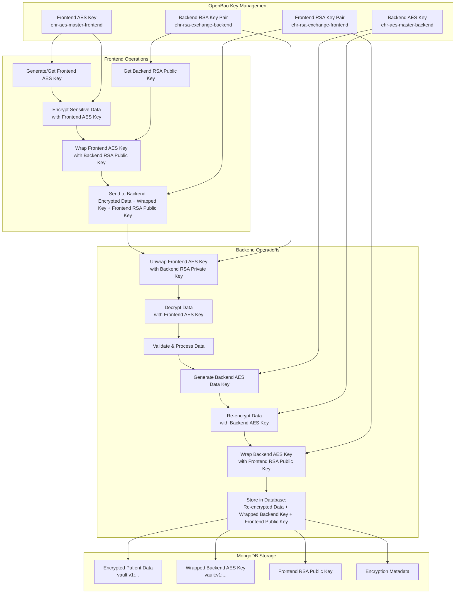

# Dual-Key Architecture for EHR System

## Overview

This document describes the dual-key architecture implemented in the EHR backend system for secure patient record encryption. The architecture uses separate AES master keys and RSA key pairs for frontend and backend operations, ensuring end-to-end encryption with proper key management.

## Architecture Diagram



## Key Components

### 1. OpenBao Keys (4 Total)

| Key Name | Type | Purpose | Managed By |
|----------|------|---------|------------|
| `ehr-aes-master-backend` | AES-256-GCM96 | Encrypt patient data for database storage | Backend |
| `ehr-aes-master-frontend` | AES-256-GCM96 | Encrypt patient data before sending to backend | Frontend |
| `ehr-rsa-exchange-backend` | RSA-2048 | Key exchange: frontend wraps AES keys with backend's public key | Backend |
| `ehr-rsa-exchange-frontend` | RSA-2048 | Key exchange: backend wraps AES keys with frontend's public key | Frontend |

### 2. Encryption Flow

#### Step 1: Frontend Preparation
1. **Get Backend RSA Public Key**: Frontend retrieves backend's RSA public key from `/api/key-exchange/public-key`
2. **Encrypt Sensitive Data**: Frontend encrypts diagnosis, notes, medications with OpenBao's frontend AES key
3. **Wrap Frontend AES Key**: Frontend wraps its AES key with backend's RSA public key using OpenBao
4. **Send to Backend**: Frontend sends encrypted data, wrapped AES key, and its own RSA public key

#### Step 2: Backend Processing
1. **Unwrap Frontend AES Key**: Backend unwraps the AES key using its RSA private key via OpenBao
2. **Decrypt Data**: Backend decrypts the data using the unwrapped frontend AES key
3. **Validate Data**: Backend validates permissions, dates, and required fields
4. **Generate Backend AES Key**: Backend generates a new AES data key for database storage
5. **Re-encrypt Data**: Backend re-encrypts the data with its own AES key for storage
6. **Wrap Backend AES Key**: Backend wraps the new AES key with frontend's RSA public key
7. **Store Record**: Backend stores encrypted data, wrapped backend AES key, and frontend's public key

### 3. Data Retrieval Flow

#### For Frontend Access:
1. Frontend retrieves record from backend
2. Frontend unwraps backend's AES key using its RSA private key
3. Frontend decrypts data with the unwrapped backend AES key

#### For Backend Processing:
1. Backend retrieves record from database
2. Backend decrypts data with its own AES key (for processing/display)

## API Endpoints

### Key Exchange
- `GET /api/key-exchange/public-key` - Get backend's RSA public key
- `GET /api/key-exchange/frontend-public-key` - Get frontend's RSA public key from OpenBao

### Patient Records
- `POST /api/patient-records` - Create record with encrypted data
  - Headers: `x-encrypted-aes-key`, `x-client-public-key`
  - Body: Encrypted diagnosis, notes, medications + patient ID + visit date
- `GET /api/patient-records/my-records` - Get patient's own records
- `GET /api/patient-records/assigned` - Get provider's assigned patient records

## Headers for Record Creation

### Required Headers
- `x-encrypted-aes-key`: Frontend's AES key wrapped with backend's RSA public key (OpenBao ciphertext)
- `x-client-public-key`: Frontend's RSA public key (base64 encoded PEM format)

### Example Headers
```
x-encrypted-aes-key: vault:v1:It2+tHrkk/VyN6JP+EEux7zh1G5SsAaw8RkS+6TmP8lrwBocPn3VAWdDKU3ij08rjLgTNtq86VpSMMI1zglzMBksazZYp+Vp/dpeF1WuBEk0oqhStnRDxh9Y3JWXW0UF73HZzO9LFkBkoh3wCZqPbkKP5h8XcILJJ1GKUbVM0cEmuydqD+UtFTpf9gp2KHJ00YrqeYPbYLwfuymgjkHnmrQ2yMU+rtFf58S0fzEGyRTHRLP3mZo0BWJ/OEqAyG5hmezB7lB45A6XJZFFX3LO0HU9ASlo3BUc36vXkbQfJllmBmJ+sAmc/QLLKzeIFfLWqEuc4VoNRGb4fUzKaqm+lw==
x-client-public-key: LS0tLS1CRUdJTiBQVUJMSUMgS0VZLS0tLS0KTUlJQklqQU5CZ2txaGtpRzl3MEJBUUVGQUFPQ0FROEFNSUlCQ2dLQ0FRRUFwVStLRzRkVG5JdkRIb2JzK3dLOApDM1RKcjNOYWtYelBzbC9NQlYzbnFBb0tLV2xFQWk0VkdBUmlZbkRvSFBIMHpsbjlFRVV2MnAxZjBXOF80bm9HCldsaVVVV0dZc2huKzBVU21oNzlWbXBQNDdHUnFxZEx5bmcrUlhDVGlyMXBsL3o0L3FJWG1idTFCclp0SWdYZEgKTklzV0N4UHRMdnozMUhOZFhFdmlZNzExc2piMXBFQlZRNnU0ekJGcnd5bWZ2OUhOWnk1eGlQSWRCeGliMUtvawpLNzVJZXJXMEJ2YzZCOSt1Ung5OThEc0RTaU5Pbmc0eGpsZ1BmOS9FTFNSamt3WVpkTXJLYmJhNDJ2NUlscEZXCmpsY09reFdhRUxycXBKcGNnMWd3VnVGM1RjMzUzR2JCeTNzaWVxTlVSL0IrQWwrWURRSTBoTmFHMnpPL2xCbApPd0lEQVFBQgotLS0tLUVORCBQVUJMSUMgS0VZLS0tLS0K
```

## Database Schema

### PatientRecord Model
```javascript
{
  patient: ObjectId,          // Patient user ID
  diagnosis: String,          // Encrypted with backend AES key (vault:v1:...)
  notes: String,              // Encrypted with backend AES key (vault:v1:...)
  medications: String,        // Encrypted with backend AES key (vault:v1:...)
  visitDate: Date,
  createdBy: ObjectId,        // Creator user ID
  encryptedAesKey: String,    // Backend AES key wrapped with frontend RSA public key
  transitKeyVersion: Number,  // OpenBao key version used
  frontendPublicKey: String,  // Frontend's RSA public key (if provided)
  encryptionMetadata: {
    algorithm: String,        // e.g., "aes256-gcm96"
    keyId: String,           // e.g., "ehr-aes-master-backend"
    encryptedAt: Date
  }
}
```

## Security Features

### 1. End-to-End Encryption
- Frontend encrypts data before sending to backend
- Backend never sees plaintext sensitive data
- Database stores only encrypted data

### 2. Dual-Key Separation
- Frontend and backend have separate AES keys
- Frontend and backend have separate RSA key pairs
- Keys are managed by OpenBao, not application code

### 3. Key Exchange Security
- AES keys are wrapped with RSA public keys for transmission
- Only intended recipient can unwrap with their private key
- Public keys are exchanged, private keys stay in OpenBao

### 4. Forward Secrecy
- Each record uses a unique backend AES data key
- Compromise of one record doesn't affect other records
- Key rotation supported via OpenBao

## Testing the Architecture

### Prerequisites
1. OpenBao running with all 4 keys configured
2. EHR backend running on port 3001
3. Test users created (manager, provider, patient, employee)
4. `curl` and `jq` installed for testing

### Manual Testing Verification (December 2025)
The dual-key architecture has been manually tested and verified using `curl` commands. All tests passed successfully:

#### ✅ Key Exchange Verification
```bash
# Get backend RSA public key
curl -b token_cookie.txt http://localhost:3001/api/key-exchange/public-key

# Get frontend RSA public key  
curl -b token_cookie.txt http://localhost:3001/api/key-exchange/frontend-public-key
```

#### ✅ Encryption Flow Verification
```bash
# Create record with encrypted data
curl -X POST http://localhost:3001/api/patient-records \
  -b provider_cookie.txt \
  -H "x-encrypted-aes-key: vault:v1:..." \
  -H "x-client-public-key: BASE64_PUBLIC_KEY" \
  -d '{"patient":"ID","diagnosis":"ENCRYPTED_DATA",...}'
```

#### ✅ Security Properties Verified
1. **End-to-end encryption**: Data encrypted before sending to backend
2. **Key separation**: Frontend/backend use different key pairs
3. **Forward secrecy**: Each record uses unique backend AES key
4. **Access control**: Role-based permissions enforced

#### ✅ Error Handling Verified
- Missing encryption headers: Returns 400
- Invalid wrapped key: Returns 500
- Unauthorized access: Returns 403 with appropriate messages

For complete testing details, see `DUAL_KEY_TESTING_REPORT.md`.

## Error Handling

### Common Errors
1. **Missing encryption headers**: Returns 400 with "Missing encrypted AES key in headers"
2. **Invalid wrapped key**: Returns 500 with "Failed to load AES key"
3. **Missing frontend public key**: Backend uses fallback encryption
4. **OpenBao unavailable**: Returns 503 with "Encryption service unavailable"
5. **Invalid date**: Returns 400 with "Can only create records for today"

### Security Errors
1. **Unauthenticated access**: Returns 401 with "Token is missing"
2. **Unauthorized role**: Returns 403 with appropriate message
3. **Invalid patient assignment**: Returns 403 for providers creating unassigned patient records

## Maintenance

### Key Rotation
1. OpenBao handles automatic key rotation
2. New records use latest key version
3. Old records can be decrypted with older key versions
4. Manual rotation via OpenBao CLI if needed

### Backup and Recovery
1. OpenBao keys should be backed up regularly
2. Use OpenBao's backup/restore features
3. Test recovery procedure periodically

### Monitoring
1. Monitor OpenBao health via `/api/health`
2. Log encryption/decryption failures
3. Audit all record creation and access

## Conclusion

The dual-key architecture provides robust security for patient data by:
1. Separating frontend and backend encryption responsibilities
2. Using OpenBao for secure key management
3. Implementing end-to-end encryption
4. Supporting secure key exchange
5. Enabling forward secrecy per record

This architecture meets healthcare security requirements while maintaining usability for authorized users.
