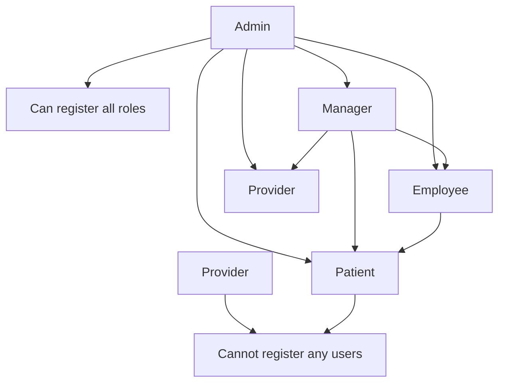
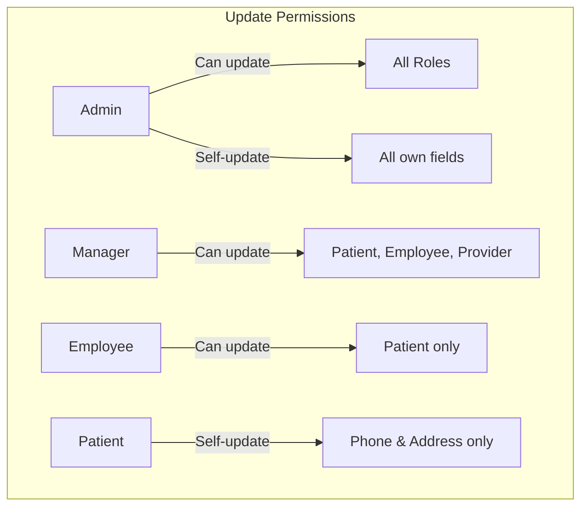
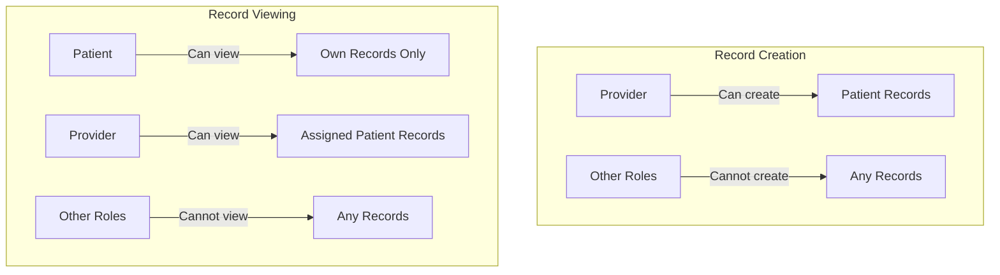

# Role-Based Access Control (RBAC) Implementation

## Introduction

### Purpose
The EHR (Electronic Health Record) system implements a comprehensive Role-Based Access Control (RBAC) system to ensure that users can only perform actions appropriate to their role. This is critical in healthcare systems where patient privacy and data security are paramount.

### Overview
The RBAC implementation is organized into three main utility modules:
1. **User Registration RBAC** (`utils/registrationRoles.js`) - Controls who can register new users
2. **User Update RBAC** (`utils/updateRoles.js`) - Controls who can update user information
3. **Patient Record Access RBAC** (`utils/recordAccessRoles.js`) - Controls access to patient medical records

### Importance in Healthcare Systems
- **Patient Privacy**: Ensures only authorized personnel can access sensitive health information
- **Regulatory Compliance**: Meets HIPAA and other healthcare privacy regulations
- **Security**: Prevents unauthorized access and data breaches
- **Auditability**: All access attempts are logged for security auditing

---

## 1. User Registration RBAC

### Utility File: `utils/registrationRoles.js`

#### Purpose
Controls which roles can register new users with specific roles in the system.

#### Registration Hierarchy
The system follows a strict hierarchical registration model:



#### Permission Matrix
| Target Role | Can Be Registered By |
|-------------|---------------------|
| Patient     | Employee, Manager, Admin |
| Provider    | Manager, Admin |
| Employee    | Manager, Admin |
| Manager     | Admin |
| Admin       | Admin (with additional checks) |

#### Code Structure
```javascript
module.exports.canRegister = {
    Patient: ['Employee', 'Manager', 'Admin'],
    Provider: ['Manager', 'Admin'],
    Employee: ['Manager', 'Admin'],
    Manager: ['Admin'],
};
```

#### Usage Example
```javascript
const { canRegister } = require('../utils/registrationRoles');

// Check if a Manager can register an Employee
if (canRegister['Employee']?.includes('Manager')) {
    // Registration allowed
}

// Check if an Employee can register a Provider
if (canRegister['Provider']?.includes('Employee')) {
    // This will be false - Employees cannot register Providers
}
```

#### API Endpoints Using This Utility
- `POST /api/users/register` - Generic registration endpoint
- `POST /api/admin/register` - Admin-specific registration
- `POST /api/managers/register` - Manager-specific registration
- `POST /api/employees/register/patient` - Employee patient registration

---

## 2. User Update RBAC

### Utility File: `utils/updateRoles.js`

#### Purpose
Controls which roles can update user information, including field-level permissions.

#### Update Permissions Matrix
| Target Role | Can Be Updated By |
|-------------|------------------|
| Patient     | Admin, Manager, Employee, Patient (self - limited fields) |
| Employee    | Admin, Manager |
| Provider    | Admin, Manager |
| Manager     | Admin |
| Admin       | Admin (including self) |

#### Special Cases
1. **Patient Self-Update**: Patients can only update their own `phone` and `address` fields
2. **Admin Self-Update**: Admins can update their own information
3. **Field-Level Restrictions**: Different roles have different updatable fields

#### Field-Level Permissions
The `getAllowedUpdateFields()` function determines which fields can be updated based on:
- Requester role
- Target role
- Whether it's a self-update

**Base Fields** (for users with permission): `name`, `email`, `phone`, `address`

**Role-Specific Fields**:
- Patient: `dateOfBirth`, `gender`, `assignedProviderId`
- Employee: `employeeId`
- Provider: `providerId`, `assignedPatients`
- Manager: `managerId`
- Admin: `adminId`

#### Visual Representation


#### Code Examples
```javascript
const { canUserUpdate, getAllowedUpdateFields } = require('../utils/updateRoles');

// Check if a Manager can update an Employee
const canUpdate = canUserUpdate('Manager', 'Employee', false); // true

// Get allowed fields for a Manager updating a Patient
const allowedFields = getAllowedUpdateFields('Manager', 'Patient', false);
// Returns: ['name', 'email', 'phone', 'address', 'dateOfBirth', 'gender', 'assignedProviderId']

// Get allowed fields for a Patient updating themselves
const patientSelfFields = getAllowedUpdateFields('Patient', 'Patient', true);
// Returns: ['phone', 'address'] only
```

#### API Endpoints Using This Utility
- `PUT /api/users/:id` - Generic update endpoint
- `PUT /api/admin/users/:id/update` - Admin update endpoint
- `PUT /api/managers/users/:id/update` - Manager update endpoint
- `PUT /api/employees/users/:id/update` - Employee update endpoint
- `PUT /api/patients/profile` - Patient self-update endpoint

---

## 3. Patient Record Access RBAC

### Utility File: `utils/recordAccessRoles.js`

#### Purpose
Controls access to patient medical records with strict privacy enforcement.

#### Access Rules
1. **Record Creation**: Only Providers can create patient records
2. **Record Viewing**:
   - Patients can view their own records
   - Providers can view records of patients assigned to them
   - No one can view all records (no "view all" permission)

#### Permission Functions
| Function | Purpose | Returns true for |
|----------|---------|------------------|
| `canCreateRecord(role)` | Check if role can create records | Provider only |
| `canViewAllRecords(role)` | Check if role can view all records | Always false |
| `canViewOwnRecord(role, requesterId, record)` | Check if can view own record | Patient viewing their own record |
| `canViewRecordById(role, requesterId, record)` | Check if can view specific record | Patient (own) or Provider (assigned) |

#### Visual Representation


#### Code Examples
```javascript
const { 
    canCreateRecord, 
    canViewOwnRecord, 
    canViewRecordById 
} = require('../utils/recordAccessRoles');

// Check if a Provider can create records
const canCreate = canCreateRecord('Provider'); // true

// Check if a Patient can view their own record
const canViewOwn = canViewOwnRecord('Patient', patientId, record);
// Returns true if patientId === record.patient._id

// Check if a Provider can view a specific record
const canView = canViewRecordById('Provider', providerId, record);
// Returns true if providerId === record.patient.assignedProviderId
```

#### API Endpoints Using This Utility
- `POST /api/patient-records` - Create patient record (Provider only)
- `GET /api/patient-records/my-records` - Get own records (Patient only)
- `GET /api/patient-records/:id` - Get specific record (Patient or assigned Provider)
- `GET /api/providers/patient-records` - Get assigned patient records (Provider only)

---

## 4. Integration with Controllers

### User Controller Integration (`controllers/userController.js`)

#### Registration Example
```javascript
exports.registerUser = async (req, res) => {
    const creator = req.user;
    const { role } = req.body;
    
    // Check registration permissions
    if (!canRegister[role]?.includes(creator.role)) {
        return res.status(403).json({ 
            message: `Not allowed to register this ${role}` 
        });
    }
    // ... rest of registration logic
};
```

#### Update Example
```javascript
exports.updateUser = async (req, res) => {
    const requester = req.user;
    const user = await User.findById(id);
    const isSelf = requester.id === user.id;
    
    // Check update permissions
    if (!canUserUpdate(requester.role, user.role, isSelf)) {
        return res.status(403).json({ 
            message: 'Not authorized to update this user' 
        });
    }
    
    // Get allowed fields
    const allowedFields = getAllowedUpdateFields(
        requester.role, 
        user.role, 
        isSelf
    );
    
    // Filter updates to only allowed fields
    const updates = {};
    for (const field of allowedFields) {
        if (req.body[field] !== undefined) {
            updates[field] = req.body[field];
        }
    }
    // ... rest of update logic
};
```

### Patient Record Controller Integration (`controllers/patientRecordController.js`)

#### Record Creation Example
```javascript
exports.createRecord = async (req, res) => {
    const creator = req.user;
    
    // Check if user can create records
    if (!canCreateRecord(creator.role)) {
        return res.status(403).json({ 
            message: 'Only providers can create patient records' 
        });
    }
    // ... rest of creation logic
};
```

#### Record Viewing Example
```javascript
exports.getRecordById = async (req, res) => {
    const requester = req.user;
    const record = await PatientRecord.findById(req.params.id)
        .populate('patient', 'name email assignedProviderId');
    
    // Check viewing permissions
    if (!canViewRecordById(requester.role, requester.id, record)) {
        return res.status(403).json({ 
            message: 'Not authorized to view this record' 
        });
    }
    // ... rest of viewing logic
};
```

---

## 5. API Endpoints Reference

### User Management Endpoints

| Endpoint | Method | Required Role | RBAC Check | Purpose |
|----------|--------|---------------|------------|---------|
| `/api/users/register` | POST | Admin, Manager, Employee | `registrationRoles.js` | Register new user |
| `/api/users/:id` | PUT | Authenticated | `updateRoles.js` | Update user |
| `/api/admin/register` | POST | Admin | `registrationRoles.js` | Admin registration |
| `/api/admin/users/:id/update` | PUT | Admin | `updateRoles.js` | Admin update user |
| `/api/managers/register` | POST | Manager, Admin | `registrationRoles.js` | Manager registration |
| `/api/managers/users/:id/update` | PUT | Manager, Admin | `updateRoles.js` | Manager update user |
| `/api/employees/register/patient` | POST | Employee, Manager, Admin | `registrationRoles.js` | Employee register patient |
| `/api/employees/users/:id/update` | PUT | Employee, Manager, Admin | `updateRoles.js` | Employee update user |
| `/api/patients/profile` | PUT | Patient | `updateRoles.js` | Patient self-update |

### Patient Record Endpoints

| Endpoint | Method | Required Role | RBAC Check | Purpose |
|----------|--------|---------------|------------|---------|
| `/api/patient-records` | POST | Provider | `recordAccessRoles.js` | Create record |
| `/api/patient-records/my-records` | GET | Patient | `recordAccessRoles.js` | View own records |
| `/api/patient-records/:id` | GET | Patient, Provider | `recordAccessRoles.js` | View specific record |
| `/api/providers/patient-records` | GET | Provider | `recordAccessRoles.js` | View assigned records |

---

## 6. Testing and Validation

### Security Test Structure
The system includes comprehensive RBAC security tests in `test/security/rbac.security.test.js` that verify:
1. Registration permissions are correctly enforced
2. Update permissions respect role hierarchies
3. Patient record access follows privacy rules
4. Unauthorized access attempts are properly rejected

### Common Test Scenarios
1. **Positive Tests**: Verify authorized users can perform actions
2. **Negative Tests**: Verify unauthorized users are rejected
3. **Edge Cases**: Test self-updates, boundary conditions
4. **Field-Level Tests**: Verify only allowed fields can be updated

### Test Example
```javascript
describe('RBAC Security Tests', () => {
    it('should prevent Employee from registering Provider', async () => {
        const employeeToken = await loginAsEmployee();
        const response = await request(app)
            .post('/api/users/register')
            .set('Cookie', `token=${employeeToken}`)
            .send({
                name: 'New Provider',
                email: 'provider@test.com',
                password: 'password123',
                role: 'Provider'
            });
        
        expect(response.status).toBe(403);
        expect(response.body.message).toContain('Not allowed');
    });
});
```

---

## 7. Best Practices and Guidelines

### Adding New Roles
1. **Update all three RBAC utilities**:
   - Add to `registrationRoles.js` - who can register this role
   - Add to `updateRoles.js` - who can update this role
   - Add to `recordAccessRoles.js` - what records this role can access

2. **Define role-specific fields** in `updateRoles.js` if needed

3. **Create role-specific routes** following existing patterns

4. **Update tests** to cover the new role

### Modifying RBAC Permissions
1. **Change utility files directly** - permissions are centralized
2. **Update documentation** - keep this document current
3. **Run security tests** - verify changes don't break security
4. **Consider audit implications** - changing permissions may affect compliance

### Security Considerations
1. **Principle of Least Privilege**: Users should have minimum necessary access
2. **Separation of Duties**: Critical actions should require multiple roles
3. **Audit Logging**: All access attempts are logged in `AuditLog`
4. **Regular Reviews**: Periodically review and audit RBAC permissions
5. **Defense in Depth**: RBAC is one layer of security; combine with encryption, authentication, etc.

### Common Pitfalls to Avoid
1. **Hardcoding permissions** in controllers - always use utility files
2. **Assuming hierarchical relationships** - explicitly define all permissions
3. **Forgetting field-level restrictions** - consider what fields each role can modify
4. **Neglecting self-update cases** - handle user updates to their own account specially

---

## 8. Conclusion

The RBAC implementation in the EHR system provides a robust, maintainable, and secure access control framework. By centralizing permissions in utility files and following consistent patterns, the system ensures:

1. **Security**: Unauthorized access is prevented
2. **Maintainability**: Permissions are easy to understand and modify
3. **Auditability**: All access decisions follow clear rules
4. **Compliance**: Meets healthcare privacy requirements

For any questions or modifications to the RBAC system, consult this documentation and ensure all changes are properly tested and documented.

---

*Last Updated: December 24, 2025*  
*Document Version: 1.0*
